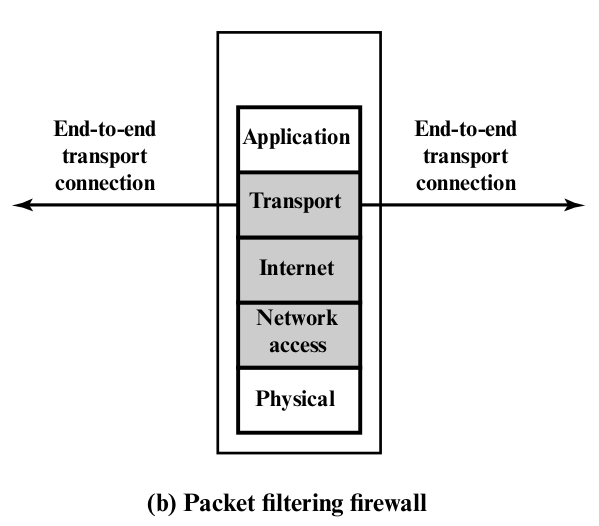
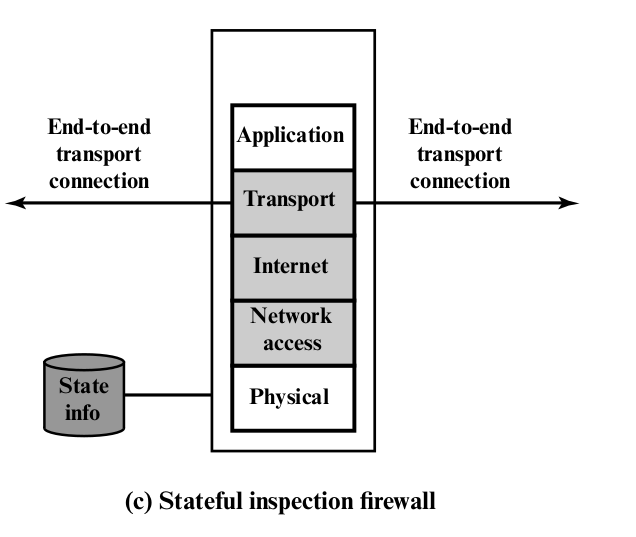
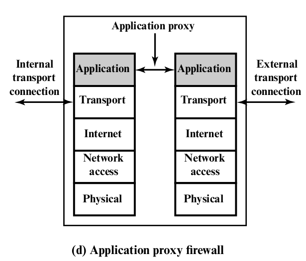
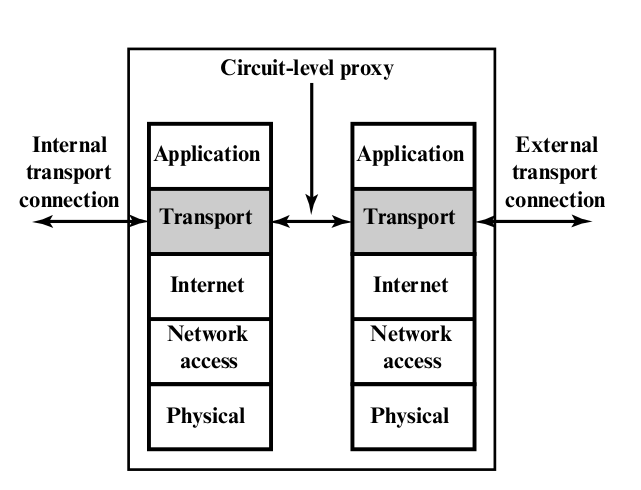
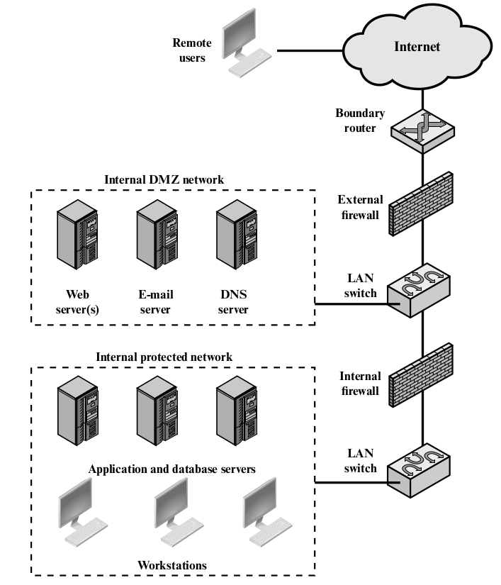
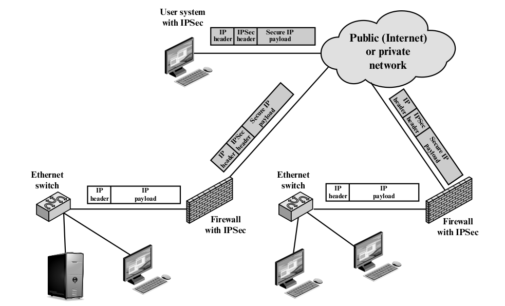
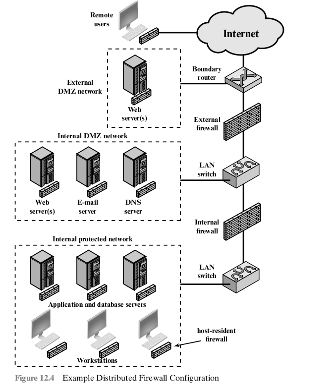

# FireWall

- Provides an additional layer of defense, insulating
  the internal systems from external networks.

## Firewall Characteristics and Access Policy

### Design Goal

- All traffic from inside to outside, and vice versa, must pass
  through the firewall.
- Only authorized traffic will be allowed to pass.
- The firewall itself is immune to penetration.

### Characteristics to filter

- IP Address and Protocol Values
- Application Protocol
- User Identity
- Network Activity

### Capabilities

- Defines a single choke point that keeps unauthorized users out of the
  protected network, prohibits potentially vulnerable services from
  entering or leaving the network, and provides protection from various
  kinds of IP spoofing and routing attacks.
- Provides a location for monitoring security-related events.
- A convenient platform for several Internet functions that are not
  security related.
- Serve as the plat form for IPsec. Implement VPN.

### Limitations

- Cannot protect against attacks that bypass the firewall.
- Not protect fully against internal threats.
- An improperly secured wireless LAN may be accessed from outside the organization.
- A laptop, PDA, or portable storage device may be used and infected outside
  the corporate network, and then attached and used internally.

## Types of Firewalls

- Packet Filtering Firewall
  - Source IP address
  - Destination IP address
  - Source and destination transport-level address
  - IP protocol field
  - Interface

### Attack and Countermeasure

- IP address spoofing
  - Discard packets with an inside source address if the packet arrives on an external interface.
- Source routing attacks
  - Discard all packets that use this option.
- Tiny fragment attacks: 希望只有第一個被攔，後面可以通過？
  - enforcing a rule that the first fragment of a packet must contain a predefined minimum amount
    of the transport header.

### Stateful Inspection Firewalls

- Reviews the same packet information as a packet filtering firewall, but also records information
  about TCP connections.

### Application-Level Gateway

- application proxy, acts as a relay of application-level traffic.
- Need only scrutinize(審查) a few allowabe applications.
- Diadvantage: additional processing overhead on each connection.

### Circuit-Level Gateway

- Circuit-level proxy.
- SOCKs

## Firewall Basing

### Bastion Host

- Is a system identified by the firewall administrator as a critical stron point in the network's security.
- Serves as a platform for an application-level or cirvuit-level gateway.

#### Characteristics

- 較安全的 OS
- only install essential services. DNS, FTP, HTTP, SMTP
- require additional authentication before a user is allowed access to the proxy.
- Each proxy requrie its own authentication.
- Each proxy in configured to support only a subset of the standard application's command set.
- Each proxy is configured to allow access only to specific host system.
- Each proxy maintains detailed audit information by logging all traffic.
- Each proxy module is a very small software package specifically designed for network security.
- Each proxy is independent of other proxies on the bastin host.
- A proxy genrerally performs no disk access.
- Each proxy runs as a nonprivileged user in a private and secured directory on the bastion host.

### Host-base Firewalls

#### Advangate

- Filtering rules can be tailored to the host environment.
  - Different filter for different application.
- Protection is provided independent of topology.
- Used in conjumction with stand-alone firewalls.

### Personal Firewall

## Firewall Location and Configurations

### DMZ Networks

- demilitarized zone network
- between external firewall and internal firewall.

- internal firewall
  - 較嚴格
  - 保護 Internal nework an DMZ from attacks from each.
  - Multiple internal firewalls can be used.

### VPN

- virtual private network
- A VPN consists of a set of computers that interconnect by means of a relatively unsecure network
  and that make use of encryption and special protocols to provide security.

## Distributed Firewalls

## Summary

- **Host-resident firewall**: This category includes personal firewall software and firewall software
  on servers. Such firewalls can be used alone or as part of an in-depth firewall deployment.
- **Screening router**: A single router between internal and external networks with stateless or full
  packet filtering. This arrangement is typical for small office/home office (SOHO) applications.
- **Single baston inline**: A single firewall device between an internal and external router.
  The firewall may implement stateful filters and or application proxies. This is the typical firewall
  applicance configuratin for small to medium-sized organizations.
- **Single bastion T**: Similar to single bastion inline but has a third network interface on bastion to
  a DMZ where externally visible servers are placed. Again, this is a common appliance configuration for
  medium to large organizations.
- **Double bastion inline**: DMZ is sandwiched between bstin firewalls. For large businesses and
  government organization.
- **Double bastion T**: The DMZ is on a separate network interface on the bastion firewall.
- **Distributed firewall configuration**
