# IP Security

- Feature: It can encrypt and/or authenticate all traffic at the IP level

## Benefits

- When IPsec is implemented in a firewall or router, it provides strong
    security that can be applied to all traffic crossing the perimeter.
- IPsec in a firewall is resistant to bypass if all traffic from the
    outside must use IP and the firewall is the only means of entrance
    from the Internet into the organization.
- IPsec is below the transport layer (TCP, UDP) and so is transparent
    to applications.
  - There is no need to change software on a user or server system when
      IPsec is implemented in the firewall or router.
- IPsec can be transparent to end users
  - There is no need to train users on security mechanisms, issue keying
      material on a peruser basis, or revoke keying material when users
      leave the organization.
  - *Deying material* Key, code or authentication information in
      physical, electronic, or magnetic form. It includes key tapes and
      list, codes, authenticators, one-time pads, floppy disks, and
      magnetic tapes containing keys, plugs, keyed microcircuits,
      electronically generated key, etc.
- IPsec can provide security for individual users if needed
  - This is useful for offsite workers and for setting up a secure
      virtural subnetwork within an organization for sensitive applications

## Routing Applications

- IPsec can play a vital role in the routing architecture required for
    internetworking.
  - A router advertisement comes from an authorized router.
  - A router seeking to establish or maintain a neighbor relationship
      with a router in another routing domain is an authorized router.
  - A redirect message comes from the router to which the initial IP
      packet was sent.
  - A routing update is not forged.

## IPsec Documents

- Architecture
  - Covers the general concepts, security requirements, definitions,
      and mechanisms defining IPsec technology
  - The current specification is RFC4301, Security Architecture for
      the Internet Protocol
- Encapsulating Security Payload (ESP)
  - Consists of an encapsulating header and trailer used to provide
      encryption or combined encryption/ authentication
- Internet Key Exchange (IKE)
  - A collection of documents describing the key management schemes
      for use with IPsec.
  - The main specification is RFC5996, Internet Key Exchange Protocol,
      but there are a number of related RFCs
- Cryptographic algorithms
  - This category encompasses a large set of documents that define and
      describe cryptographic algorithms for encryption, message
      authentication, pseudorandom functions(PRFs), and cryptographic
      key exchange.
- Other
  - There are a variety of other IPsec-related RFCs, including those
      dealing with security policy and management information base (MIB)
      content.

## IPsec Srvices

- IPsec provides security services at the IP layer by enabling a system
    to:
  - Select required security protocols
  - Determine the algorithms(s) to use for the service(s)
  - Put in place any cryptographic keys required to provide the
      requested services.
- RFC 4301 lists the following services:
  - Access control
  - Connectionless integrity
  - Data origin authentication
  - Rejection of replayed packets (a form of partial sequence integrity)
  - Confidentiality (encryption)
  - Limited traffic flow confidentiality

## Transport and Tunnel Modes

- Transport Mode
  - Provides protection primarily for upper-layer protocols
  - Examples include a TCP or UDP segment or an ICMP packet
  - Typically used for end-to-end communication between two hosts
  - ESP in transport mode encrypts and optionally authenticates the IP
      payload but not the IP header
  - AH in transport mode authenticates the IP payload and selected
      portions of the IP header
- Tunnel Mode
  - Provides protection to the entire IP packet
  - Used when one or both ends of a security associatin (SA) are security
      gateway
  - A number of hosts on networks behind firewalls may engage in secure
      communications without implementing IPsec.
  - ESP in tunnel mode encrypts and optionally authenticates the entire
      inner IP packet, including the inner IP header.
  - AH in tunnel mode authenticates the entire inner IP packet and
      selected portions of the outer IP header.
      
      

## IP Security Policy

### Security Associations

- An association is a one-way logical connection between a sender and a receiver
    that affords security services to the traffic carried on it. If a peer relationship
    is needed for two-way secure exchange, then two security associations are required.
- **Security Parameters Index (SPI)**: A 32-bit unsigned integer assigned to this SA and
    having local significance only. The SPI is carried in AH and ESP headers to enable the
    receiving system to select the SA under which a received packet will be processed.
- **IP Destination Address**: This is the address of the destination endpoint of the SA, which
    may be an end-user system or a network system such as a firewall or router.
- **Security Protocol Identifier**: This field from the outer IP header indicates whether the
    association is an AH or ESP security association.

### Security Association Database

- Defines the parameters associated with each SA. 定義每個 SA 的參數
- **Security Parameter Index**: selected by the receiving end of an SA to uniquely identify the SA.
  - Outbound SA: used to construct the packet's AH or ESP header.
  - Inbound SA: used to map traffic to the appropriate SA.
- **Sequence Number Counter**
- **Sequence Counter Overflow**
- **Anti-Replay Window**: Used to determine whether an inbound AH or ESP packet is a replay.
- **AH Information**: Authentication algorithm, keys, key liftimes, and related parameters
    being used with AH.
- **ESP Information**
- **Lifetime of this Security Association**
- **IPsec Protocol Mode**: Tunnel, transport, or wildcard.
- **Path MTU**: Any observed path maximum transmission unit (maximum size of a packet that can
    be transmitted without fragmentation) and aging.

### Security Policy Database

- Which IP traffic is related to specifics SAs. 紀錄哪個 SA 對應哪個 IP
- Each SPD entry is defined by a set of IP and upper-layer protocol field values
    called *selectors*. In effect, these selectors are used to filter outgoing traffic
    in order to map it into a particular SA.

#### Outbound Processing

1. Compare the values of the appropriate fields in the packet (the selector fields)
against the SPD to find a matching SPD entry, which will point to zero or more SAs.
2. Determine the SA if any for this packet and its associated SPI.
3. Do the required IPsec processing (i.e., AH or ESP processing).

#### Following selectors determine an SPD entry

- **Remote IP Address**
- **Local IP Address**
- **Next Layer Protocol**
- Name
- Local and Remote Ports

    

### IP Traffic Processing

- 先去 SPD 找 IP, 若有則繼續，沒有則丟棄。
- 再看 policy, BYPASS, DISCASRD, PROTECT
- PROTECT 再去看SAD

#### Outbound Packets

1. IPsec searches the SPD for a match to this packet.
2. If no match is found, then the packet is discarded and an error message is generated.
3. If a match is found, further processing is determined by the first matching entry in the SPD.
If the policy for this packet is DISCASRD, then the packet is discarded. If the policy is BYPASS,
then there is no further IPsec processing; the packet is forwarded to the network for transmission.
4. If the policy is PROTECT, then a search is made of the SAD for a matching entry. If no entry is
found, then IKE is invoked to create an SA with the appropriate keys and an entry is made in the SA.
5. The matching entry in the SAD determines the processing for this packet.
   - Encryption
   - Authentication
   - Transport
   - Tunnel
       

#### Inbound Packets

1. Ipsec determines whether this is an unsecured IP packet or one that has ESP or AH headers/trailers,
by examining the IP Protocol field (IPv4) or Next Header field (IPv6).
2. If the packet is unsecured, IPsec searches the SPD for a match to this packet. If the first matching
entry has a policy of BYPASS, the IP header is processed and stripped off and the packet body is delivered
to the next higher layer, such TCP. If the first matching entry has a policy of PROTECT or DISCARD, or
if there is no matching entry, the packet is discarded.
3. For a secured packet, IPsec searches the SAD. If no match is found, the packet is discarded. Otherwise,
IPsec applies the appropriate ESP or AH processing. Then, the IP header is processed and stripped off and
the packet body is delivered to the next higher layer, such as TCP.

## Encapsulating Security Payload

- Provide
  - Confidentiality
  - Data origin authentication
  - Connectionless integrity
  - Anti-replay service (partial sequence integrity)
  - Traffic flow confidentiality
- Time: Security Association establishment
- Location: impolementation in a network topology

### ESP Format

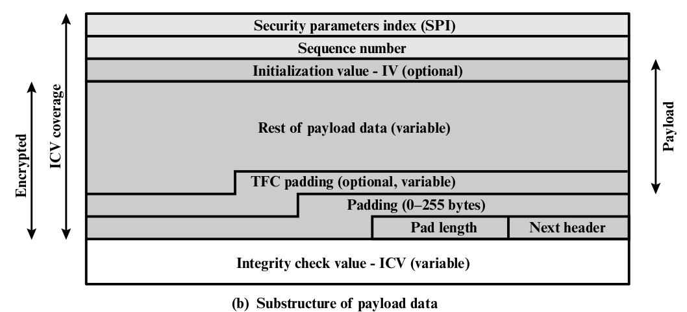

- **Security Parameters Index**
- **Sequence Number**
- **Payload Data**: A transport-level segment or IP packet that is protected by encryption.
- **Padding**
- **Pad Length**
- **Next Header**: 識別 payload 的類型。
- **Integrity Check Value(variable)**: (ESP packet) - (Authentication Data Field)
- **Initialization Value(IV)**
- **Traffic Flow Confidentiality(TFC)**

### Encryption and Authentication Algorithms

- Payload Data, Padding, Pad Length and Next Header fields are encrypted by the ESP service.
- ICV order of processing facilitates rapid detection and rejection of replayed or bogus packets
    by the receiver prior to decrypting the packet, <mark>hence potentially reducing the impact of denial
    of service attacks</mark>.

### Padding

- For encryption algorithms: Expand the plaintext to required length.
- ESP format requires Pad Length and Next Header fields be right aligned within a 32-bit word.
- Partial traffic-flow confidentiality.

### Anti-Replay Service

- Sender
  - Sequence Number
  - new SA is established, sender initializes a sequence number counter to 0.
  - if $2^{32} - 1$ is reached, sender should terminate this SA.
- Receiver
  - implement a window of size W.
  - every window, sequence number from (N-W+1) to N
      1. If the received packet falls within the window and is new, the MAC is checked.
      If the packet is authenticated, the corresponding slot in the window is marked.
      2. If the received packet is to the right of the window and is new, the MAC is checked.
      If the packet is authenticated, the window is advanced(提前) so that this sequence number
      is the right edge of the window, and the corresponding slot in the window is market.
      3. If the received packet is to the left of the window or if authentication fails,
      the packet is discarded; this is an auditable event.
      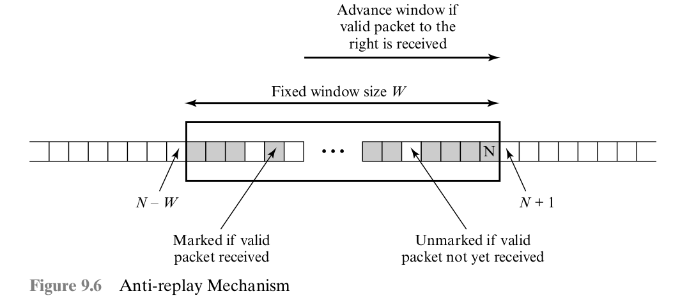

### Transport and Tunnel Modes

#### Transport

##### IPv4

- ESP header is inserted into the IP packet immediately prior to the transport-layer header.
- An ESP trailer (Padding, Pad Length, and Next Header fields) is placed after the IP packet.
    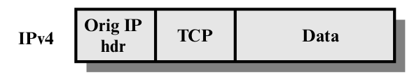
    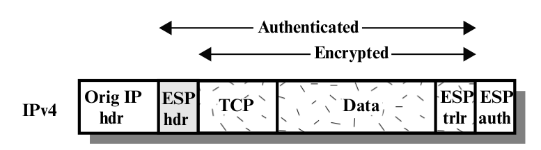

##### IPv6

- ESP is viewed as an end-to-end payload;that is, it is not examined or processed by intermediate routers.
    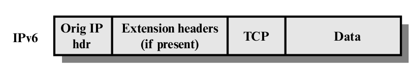
    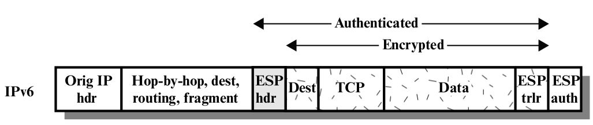

##### Summarized

1. At the source, the block of data consisting of the ESP trailer plus the entire transport-layer segment is
encrypted and the plaintext of this block is replaced with its ciphertext to form the IP packet for transmission.
Authentication is added if this option is select.
2. The packet is then routed to the destination. Each intermediate router needs to examine and process the IP header
plus any plaintext IP extension headers but does not need to examine the ciphertext.
3. The destination node examines and processes the IP header plus any plaintext IP extension headers. Then, on the
basis of the SPI in the ESP header, the destination node decrypts the remainder of the packet to recover the plaintext
transport-layer segment.

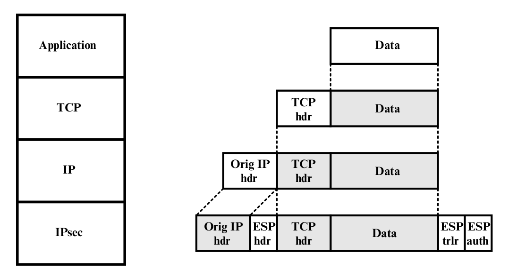

#### Tunnel Mode ESP

- 設計邏輯： 如果 IP header 被整個加密，router 會無法 routing，因此需要新的 IP header 資訊足夠 routing ，但無法做
    traffic analysis.

    1. The source prepares an inner IP packet with a destination address of the target internel host. This packet is
    prefixed by an ESP header; then the packet and ESP trailer are encrypted and Authentication Data may be added.
    The resulting block is encapsulated with a new IP header (base header plus optional extensions such as routing and
    hop-by-hop options for IPv6) whose destination address is the firewall; this forms the outer IP packet.
    2. The outer packet is routed to the destination firewall. Each intermediate router needs to examine and process the
    outer IP header plus any outer IP extension headers but does not need to examine the ciphertext.
    3. The destination firewall examines and processes the outer IP header plus any outer IP extension headers. Then on
    the basis of the SPI in the ESP header, the destination node decrypts the remainder of the packet to recover the
    plaintext inner IP packet. Thies packet is then transmitted in the internal network.
    4. The inner packet is routed through zero or more routers in the internal network to the destination host.

    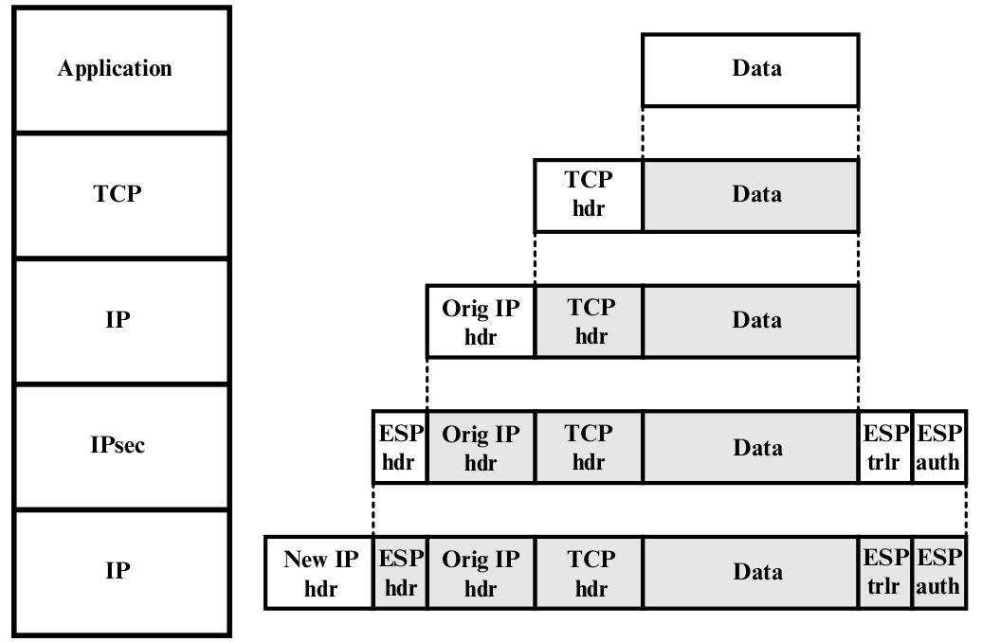

## Combining Security Associations

- **Security Association Bundle** refers to a sequence of SAs through which traffic must be processed to provide a
    desired set of IPsec services.
- **Transport adjacency** refers to applying more than one security protocol to the same IP packet without invoking
    tunneling. allows for only one level of combination. 加更多層沒有用
- **Iterated tunneling** refers to the application of multiple layers of security protocols effected through IP tunneling.
    allows for multiple levels of nesting.

### Authentication Plus Confidentiality

#### ESP with Authentication Option

- **Transport mode ESP**
- **Tunnel mode ESP**

#### Transport Adjacency

- authentication after encryption
- inner ESP SA + outer AH SA
- ESP is used without authentication.
- Encryption is applied to the IP payload.
- AH is applied in transport mode, so that authentication covers the ESP plus the original IP header.
- Advantage: authentication covers more fields.
- Disadvantage: overhead 2 SA > 1 SA.

#### Transport-Tunnel Bundle

- authentication prior to encryption
- WHY?
    1. authentication data are protedcted by encryption, it is impossible for anyone to intercept the message
    and alter the authentication data without detection.
    2. desirable to store the authentication information with the message at the destination for later reference.
    It is more convenient to do this if the authentication information applies to the unencrypted message;
    otherwise the message would have to be reencrypted to verify the authentication information.
- inner transport SA + outer ESP tunnel SA.
- Authentication is applied to the IP payload plus the IP header.
- Resulting IP packet is then processed in tunnel mode by ESP.

### Basic Combinations of Security Associations

#### Case A

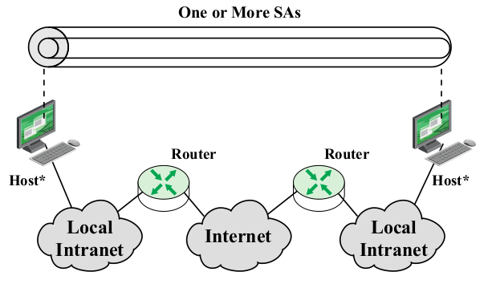

1. AH in transport mode
2. ESP in transport mode
3. ESP followed by AH in transport mode
4. Any one fo a, b, or c inside an AH or ESP in tunnel model

#### Case B

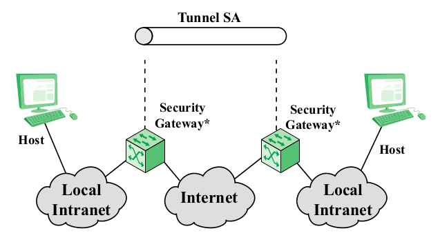

1. Security is provded only between gateways and no hosts implement IPsec.
2. Only a single tunnel SA in needed.
3. Tunnel could support AH, ESP, or ESP with the authenticaion optio.

#### Case C

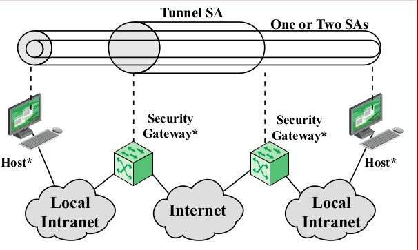

1. builds on case b by adding end-to-end security.

#### Case D

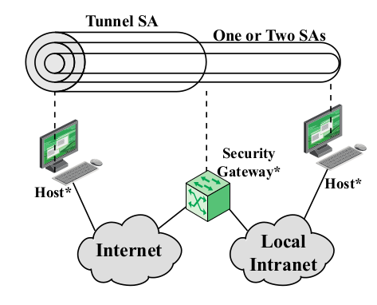

## Internet Key Exchange

- Determination + Distribution
- 4 key: transmit and receive pairs for both integrity and confidentiality.
- **Manual** v.s. **Automated**

### Automated Key management Protocol.

- ISAKMP v.s. Oakley
- Oakley: based on the Diffie-Hellman algorithm but providing added security.
- Internet Security Association and key Management Protocol (ISAKMP):
    1. does not dictate a specific key exchange algorithm.
    2. Consists of a set of message types that enable the use of a variety of key
    exchange algorithms.
    3. provides a framework.
    4. provides a specific protocol support.

### IKEv2

- ISAKMP and Oakley are no longer used.

#### Key Determination Protocol

- based on Diffie-Hellman
    1. Secret keys are created only when needed.
    2. The exchange requires no pre-existing infrasturcture.
    3. Weakness
       - man-in-the-middle attack.
       - clogging attack(應該是Diffie-Hellman計算量大，送很多假的連線需求導致服務崩壞)
- IKEv2
  - cookies to thwart clogging attack.
    - pseudorandom number.
    - fast hash over IP Source and Destination address and secret value.
  - two parties to negotiate a group, specifies the global parameters of th Diffie-Hellman key exchange.
    - Modular exponentiation or Elliptic curve group.
    - $2^x$, x are parameters to be determined.
  - nonces to ensure aganist replay attacks.
    - pseudorandom number
  - exchange of Diffie-Hellman public key values.
  - authenticates the Diffie-Hellman exchange to thwart MIM attacks.
    - Digital signatures: use private key to signing a mutually obtainable hash. hash is gerentate by ID and nonces.
    - Public-key encryption: use private to encrypting ID and nonces
    - Symmetric-key encryption: ...

#### Key Exchange

- 做四個 exchange，前二個叫 initial exchanges
- First Exchange
  - 決定 cryptographic algorithms and security parameters
  - security parameters 用來產生 nonces 和 Diffie-Hellman values
  - Exchange 的結果用來設定 IKE SA
  - IKE SA 定義等下要用哪個頻道和 security parameters
  - 等下的 subsequent IKE message exchanges are protected by encryption and message authenticaton.
- Second Exchange
  - 驗証彼此
  - set up a first IPsec SA
  - IPsec SA 用來保護原始訊息
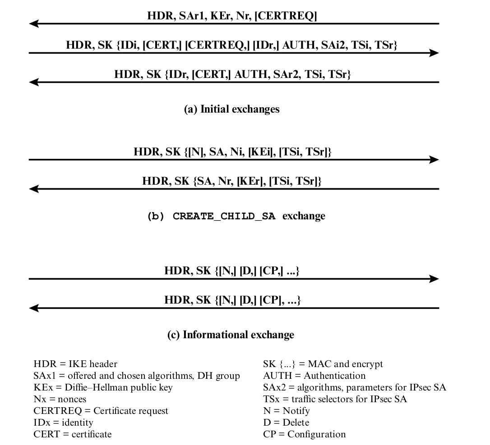
