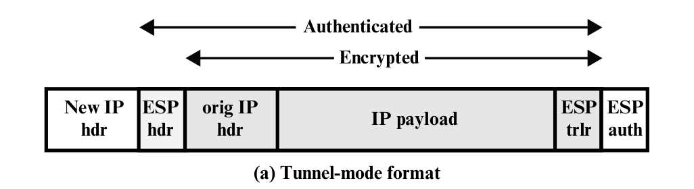
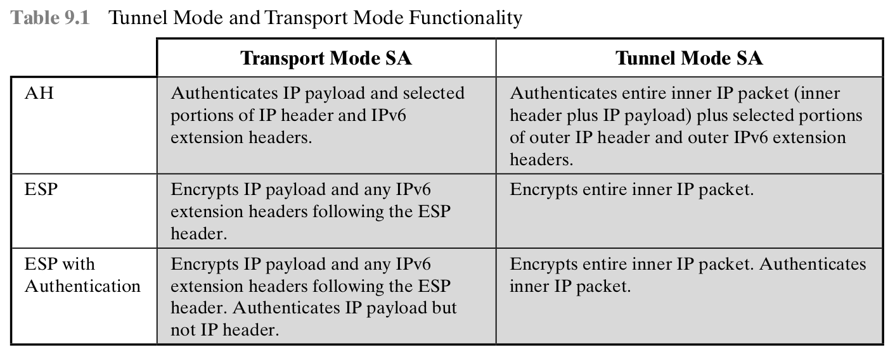
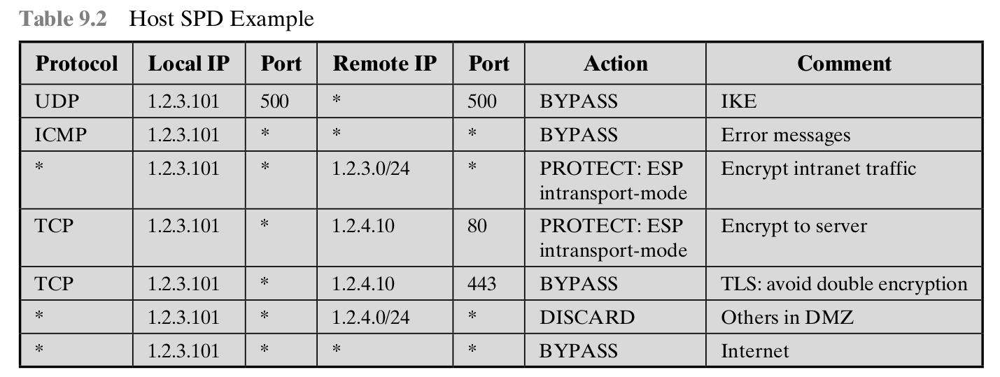
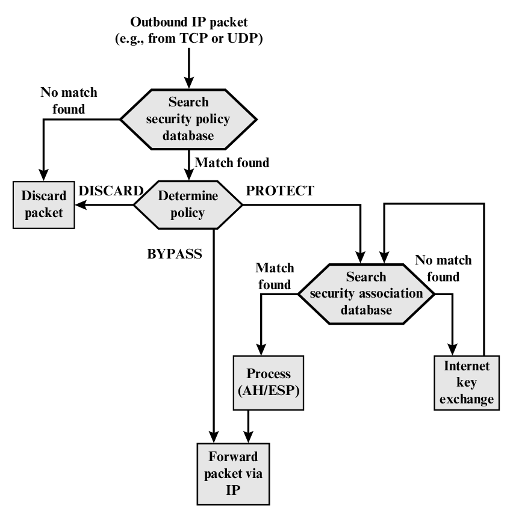
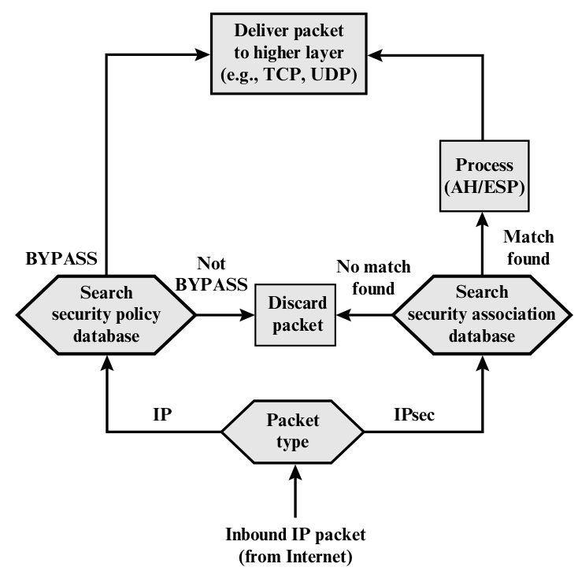

# IP Security

- Feature: It can encrypt and/or authenticate all traffic at the IP level

## Benefits

- When IPsec is implemented in a firewall or router, it provides strong
    security that can be applied to all traffic crossing the perimeter.
- IPsec in a firewall is resistant to bypass if all traffic from the
    outside must use IP and the firewall is the only means of entrance
    from the Internet into the organization.
- IPsec is below the transport layer (TCP, UDP) and so is transparent
    to applications.
  - There is no need to change software on a user or server system when
      IPsec is implemented in the firewall or router.
- IPsec can be transparent to end users
  - There is no need to train users on security mechanisms, issue keying
      material on a peruser basis, or revoke keying material when users
      leave the organization.
  - *Deying material* Key, code or authentication information in
      physical, electronic, or magnetic form. It includes key tapes and
      list, codes, authenticators, one-time pads, floppy disks, and
      magnetic tapes containing keys, plugs, keyed microcircuits,
      electronically generated key, etc.
- IPsec can provide security for individual users if needed
  - This is useful for offsite workers and for setting up a secure
      virtural subnetwork within an organization for sensitive applications

## Routing Applications

- IPsec can play a vital role in the routing architecture required for
    internetworking.
  - A router advertisement comes from an authorized router.
  - A router seeking to establish or maintain a neighbor relationship
      with a router in another routing domain is an authorized router.
  - A redirect message comes from the router to which the initial IP
      packet was sent.
  - A routing update is not forged.

## IPsec Documents

- Architecture
  - Covers the general concepts, security requirements, definitions,
      and mechanisms defining IPsec technology
  - The current specification is RFC4301, Security Architecture for
      the Internet Protocol
- Encapsulating Security Payload (ESP)
  - Consists of an encapsulating header and trailer used to provide
      encryption or combined encryption/ authentication
- Internet Key Exchange (IKE)
  - A collection of documents describing the key management schemes
      for use with IPsec.
  - The main specification is RFC5996, Internet Key Exchange Protocol,
      but there are a number of related RFCs
- Cryptographic algorithms
  - This category encompasses a large set of documents that define and
      describe cryptographic algorithms for encryption, message
      authentication, pseudorandom functions(PRFs), and cryptographic
      key exchange.
- Other
  - There are a variety of other IPsec-related RFCs, including those
      dealing with security policy and management information base (MIB)
      content.

## IPsec Srvices

- IPsec provides security services at the IP layer by enabling a system
    to:
  - Select required security protocols
  - Determine the algorithms(s) to use for the service(s)
  - Put in place any cryptographic keys required to provide the
      requested services.
- RFC 4301 lists the following services:
  - Access control
  - Connectionless integrity
  - Data origin authentication
  - Rejection of replayed packets (a form of partial sequence integrity)
  - Confidentiality (encryption)
  - Limited traffic flow confidentiality

## Transport and Tunnel Modes

- Transport Mode
  - Provides protection primarily for upper-layer protocols
  - Examples include a TCP or UDP segment or an ICMP packet
  - Typically used for end-to-end communication between two hosts
  - ESP in transport mode encrypts and optionally authenticates the IP
      payload but not the IP header
  - AH in transport mode authenticates the IP payload and selected
      portions of the IP header
- Tunnel Mode
  - Provides protection to the entire IP packet
  - Used when one or both ends of a security associatin (SA) are security
      gateway
  - A number of hosts on networks behind firewalls may engage in secure
      communications without implementing IPsec.
  - ESP in tunnel mode encrypts and optionally authenticates the entire
      inner IP packet, including the inner IP header.
  - AH in tunnel mode authenticates the entire inner IP packet and
      selected portions of the outer IP header.
      
      

## IP Security Policy

### Security Associations

- An association is a one-way logical connection between a sender and a receiver
    that affords security services to the traffic carried on it. If a peer relationship
    is needed for two-way secure exchange, then two security associations are required.
- **Security Parameters Index (SPI)**: A 32-bit unsigned integer assigned to this SA and
    having local significance only. The SPI is carried in AH and ESP headers to enable the
    receiving system to select the SA under which a received packet will be processed.
- **IP Destination Address**: This is the address of the destination endpoint of the SA, which
    may be an end-user system or a network system such as a firewall or router.
- **Security Protocol Identifier**: This field from the outer IP header indicates whether the
    association is an AH or ESP security association.

### Security Association Database

- Defines the parameters associated with each SA. 定義每個 SA 的參數
- **Security Parameter Index**: selected by the receiving end of an SA to uniquely identify the SA.
  - Outbound SA: used to construct the packet's AH or ESP header.
  - Inbound SA: used to map traffic to the appropriate SA.
- **Sequence Number Counter**
- **Sequence Counter Overflow**
- **Anti-Replay Window**: Used to determine whether an inbound AH or ESP packet is a replay.
- **AH Information**: Authentication algorithm, keys, key liftimes, and related parameters
    being used with AH.
- **ESP Information**
- **Lifetime of this Security Association**
- **IPsec Protocol Mode**: Tunnel, transport, or wildcard.
- **Path MTU**: Any observed path maximum transmission unit (maximum size of a packet that can
    be transmitted without fragmentation) and aging.

### Security Policy Database

- Which IP traffic is related to specifics SAs. 紀錄哪個 SA 對應哪個 IP
- Each SPD entry is defined by a set of IP and upper-layer protocol field values
    called *selectors*. In effect, these selectors are used to filter outgoing traffic
    in order to map it into a particular SA.

#### Outbound Processing

1. Compare the values of the appropriate fields in the packet (the selector fields)
against the SPD to find a matching SPD entry, which will point to zero or more SAs.
2. Determine the SA if any for this packet and its associated SPI.
3. Do the required IPsec processing (i.e., AH or ESP processing).

#### Following selectors determine an SPD entry

- **Remote IP Address**
- **Local IP Address**
- **Next Layer Protocol**
- Name
- Local and Remote Ports

    

### IP Traffic Processing

- 先去 SPD 找 IP, 若有則繼續，沒有則丟棄。
- 再看 policy, BYPASS, DISCASRD, PROTECT
- PROTECT 再去看SAD

#### Outbound Packets

1. IPsec searches the SPD for a match to this packet.
2. If no match is found, then the packet is discarded and an error message is generated.
3. If a match is found, further processing is determined by the first matching entry in the SPD.
If the policy for this packet is DISCASRD, then the packet is discarded. If the policy is BYPASS,
then there is no further IPsec processing; the packet is forwarded to the network for transmission.
4. If the policy is PROTECT, then a search is made of the SAD for a matching entry. If no entry is
found, then IKE is invoked to create an SA with the appropriate keys and an entry is made in the SA.
5. The matching entry in the SAD determines the processing for this packet.
   - Encryption
   - Authentication
   - Transport
   - Tunnel
       

#### Inbound Packets

1. Ipsec determines whether this is an unsecured IP packet or one that has ESP or AH headers/trailers,
by examining the IP Protocol field (IPv4) or Next Header field (IPv6).
2. If the packet is unsecured, IPsec searches the SPD for a match to this packet. If the first matching
entry has a policy of BYPASS, the IP header is processed and stripped off and the packet body is delivered
to the next higher layer, such TCP. If the first matching entry has a policy of PROTECT or DISCARD, or
if there is no matching entry, the packet is discarded.
3. For a secured packet, IPsec searches the SAD. If no match is found, the packet is discarded. Otherwise,
IPsec applies the appropriate ESP or AH processing. Then, the IP header is processed and stripped off and
the packet body is delivered to the next higher layer, such as TCP.

