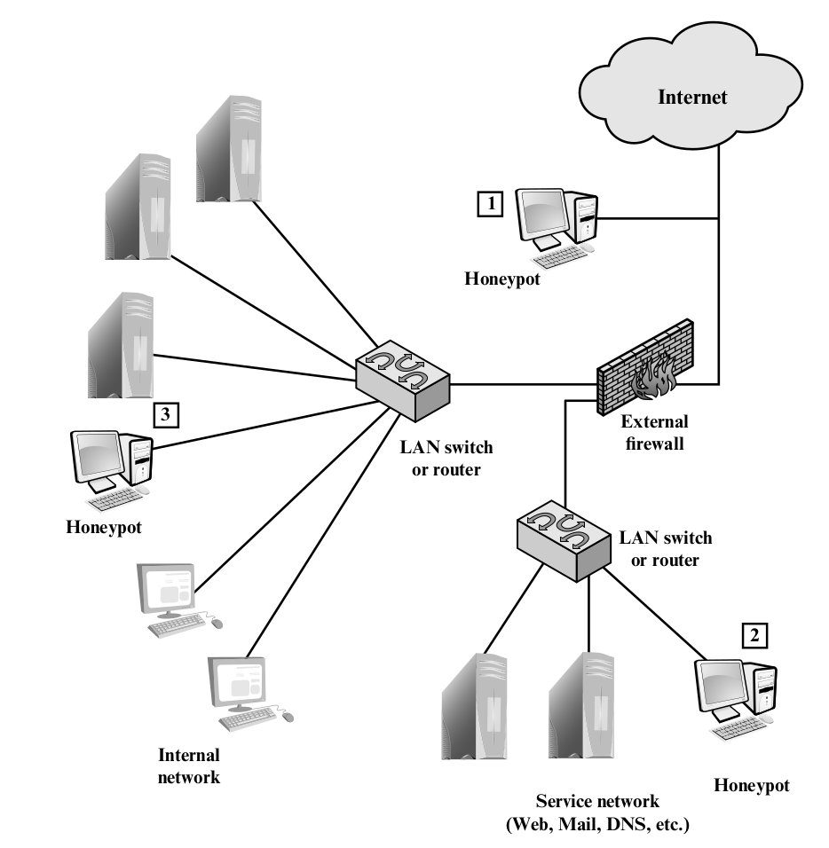

# Intruders

## Intruders

- **Masquerader** An individual who is not authorized to use the computer
  and who penetrates(滲透) a system's access controls to exploit a legitimate
  user's account.
- **Misfeasor** A legitimate user who accesses data, programs, or resources for
  which such access is not authorized, or who is authorized for such access but
  misuses his or her privileges.
- **Clandestine user**: An individual who seizes(奪取) supervisory control of the sytem
  and uses this control to evade auditing and access controls or to suppress
  audit collection.

### Intruder Behavior Patterns

- Hackers
- Criminals
- Insider Attacks

- computer emergency response teams (CERTs)

### Intrusion Techniques

## Intrusion Detection

- false positives: 正常判為不正常
- false negatives: 漏抓

- **Statistical anomaly detection**
- **Rule-based detection** or **Signature detection**

### Audit Records

- Native autid records
  - no additional collection software is needed.
  - not contain the needed information or convenient form
- Detection-stecific audit records
  - vendor independent and ported to a variety of system
  - overhead

### Statistical Anomaly Detection

- threshold detection
- profile-based system
  - characterizing the past behavior of individual users
  - analysis of audit records
    - counter
    - gauge
    - interval timer
    - resource utilization
  - metrics
    - mean and standard deviation
    - multivariate
    - markov process
    - time series
    - operational

### Rule-Based Intrusion Detection

- **Rule-based penetration identification**
  - known penetrations or penetrations that would exploit known weaknesses
  - Analyze attack tools and scripts collected on the Internet.
- USTAST
  - A model independent of specific audit records
  - Deals in general actions rather than the detailed specific actions
    recorded by the UNIX auditing mechanism.

### Base-Rate Fallacy

- 無法兼顧 high rate of detections 和 low rate of false alarms
- To be of practical use, an intrusion detection system should detect
  a substantial percentage of intrusions while keeping the false alarm
  rate at an acceptable level.
  - If only a modest percentage of actual intrusions are detected,
    the system provides a false sense of security(false negative high,
    some are undetected)
  - If the system frequently triggers an alert when there is no intrusion,
    then either system managers will begin to ignore the alarms or much
    time will be wasted analyzing the false alarms(false positive high,
    false alarm)
- Because of the nature of the probabilities involved, it is very difficult
  to meet the standard of high rate of detections with a low rate of false
  alarms
  - If the actual numbers of intrusions is low compared to the number of
    legitimate uses of a system, then the false alarm rate will be high
    unless the test is extremely discriminating.

### Distributed Instrusion Detection

- Major Issue
  - Different format of record.
  - One or more nodes in the network will serve as collection and analysis
    points for the data from the systems on the network.
    - Integrity
    - Confidentiality
  - Centralized or decentralized

## Honeypots

- decoy(誘餌) system
- divert an attacker from accessing critical systems
- collect information about the aattacker's activity
- encourage the attack to stay on the system long enough for administrators to respond.
- Filled with fabricated(捏造) information.
- No production value.
- Any attempt to commmunicate with is most likely a probe, scan, or attack.
- emulate an enterprise.

1. tracking attempts to connect to unused IP.
  - little or no ability to trap internal attackers.
2. DMZ(demilitarized zone)
  - Web and mail services
  - The security administrator must assure that the other systems in the DMZ are secure
    against any activity generated by the honeypot.
  - disadvantage: This location is that a typical DMZ is not fully accessible, and the
    firewall typically blocks traffic to the DMZ that attempts to access uneeded services.
    Thus the firewall either has to open up the traffic beyond what is permissible, which
    is risky, or limit the effectiveness of the honeypot.
3. Advantage
  - catch internal attack.
  - detect a misconfigured firewall that forwards impermissible traffic from the Internet.
  Disadvantage
  - honeypot is compromised so that it can attack other internal systems.
  - traffic from the Internet to the attacker is not blocked by the firewall.
  - firewall must adjust.

- Intrusion Detection Message Exchange Requirements
- Intrusion Dection Message Exchange Format
- Intrusion Detection Exchange Protocol

- Intrusion Detection Compoment
  - Data source
  - Sensor
  - Analyzer
  - Administrator
  - Manager
  - Operator

## Password Management

- Provide security in following ways:
  - authorized to gain access to a system.
  - determines the privileges
  - discretionary access control

- Vulnerability of Passwords
  - Offline dictionary attack
    - Unauthorized access to password file.
    - Countermeasure:
      - access control
      - identify a compromse
      - rapid reissuance of passwords should the password file be compromised.
  - Specific account attack
    - target a specific account
    - countermeasure
      - lock out access to the account after a number of failed login attempt.
  - Popular password attack
    - countermeasure
      - policies to inhibit
  - Password guessing against single user
    - training and policies that make password difficult to guess.
    - length, character set...
  - Workstation hijacking
    - automatically logging the workstation out.
  - Exploiting user mistakes
    - user writes password down.
    - countermeasure
      - user training
      - simple password + another authentication
  - Electronic monitoring

- Hashed Passwords
- salt value

- Password Cracking
- large dictionary
- rainbow table: 各種常見密碼加 salt value 的組合

- User Password Choices

- Password Selection Strategies
  - User Education
  - Computer-generated Passwords
    - difficult to remember
  - reactive password checking
    - 系統自己去破解，如果破解就把它禁用，並通知使用者
    - 耗費資源
    - 被發現前都存在風險
  - proactive password checker
    - 設密碼時就檢查強度。

- Proactive password checker
- rule base: 長度，字元...
- reject bad password

- Bloom Filter
- 定義好幾個 hash function
- 若一新密碼全部的 hash value 都撞到就 reject
