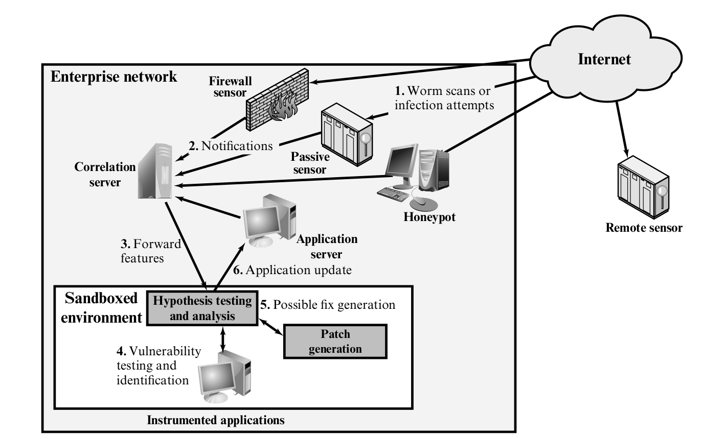
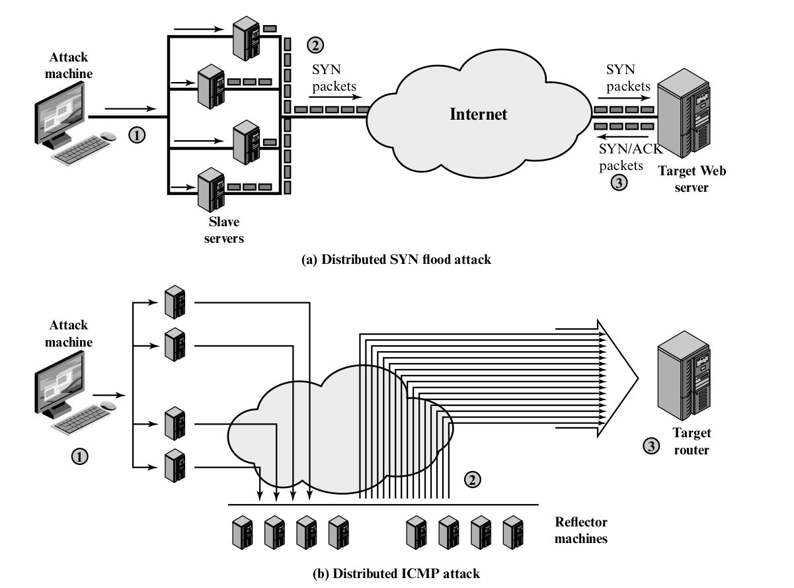
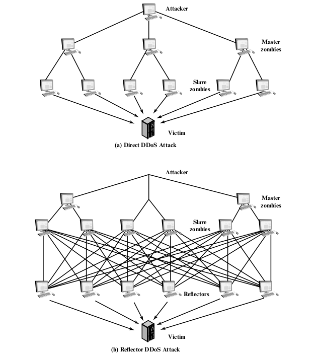

# System Security

## Types of Malicious Software (Malware)

- **Virus**: replicate itself into other executable code
- **Worm**: can run independently, propagate a complete working version of itself
  onto other hosts.
- **Logic bomb**: lies dormant(休眠) until a predifned condition is met; triggers
  an unauthorized act.
- **Trojan horse**: useful function has a hidden and potentially malicious function.
- **Backdoor(trapdoor)** by pass normal security check. allow unauthorized access.
- **Mobile code** 在不同平台上執行同一代碼
- **Exploits** Code specific to a single vulnerability or set of vulnerabilities
- **Downloaders**
- **Auto-rooter**
- **Kit** Set of tools for generating new viruses automatically.
- **Spammer programs** Used to send large volumes of unwanted e-mail.
- **Flooders** DDoS tool. (large traffic)
- **Keyloggers**
- **Rootkit** tool to get root-level access.
- **Zombie, bot** Program activated on an infected machine that is activated to
  launch attacks on other machines.
- **Spyware** Software that collects information from a computer and transmits
  it to another system.
- **Adware** Advertising that is integrated into software. It can result in
  pop-up ads or redirection of a browser to a commercial site.

- Propagation: 散播方式，有無主体…
- Payload: 行為，破壞、竊取…

- **blended attack** multiple methods of infection or propagation, to maximize the
  speed of contagion(傳染) and the serverity of the attack.

## Advanced Persistent Threat (APT)

- 有目標且持續性的
- well-resourced, persistent application of a wide variety of intrusion technologies
  and malware to selected target.
- careful target selection, persistent, stealthy, intrusion efforts over extended periods.
- **Advanced**: 結合不同的軟体及技巧，不一定最先進但適合目標。
- **Persistent**: 在較長時期內確定攻擊的應用針對選定的目標，以最大限度地提高成功的機會。
- **Threats**: 有組織的攻擊，資金充裕，積極投入…造成威脅程度上升。

## Propagation - Infected Content - Viruses

- parasitic software fragments.
- Nature of Virus: infect other programs.
- Components:
  - Infection mechanism or infection vector.
  - Trigger, known as logic bomb.
  - Payload, what virus does.
- Phases:
  - Dormant: idle.
  - Propagation: places a copy of itself into others.
  - Triggering: virus is activated to perform.
  - Execution: function is performed.

- 如果 virus 只是單純的 infected 到其他 code 很容易被發現，因為長度不一樣。
  所以會壓縮要感染的 code  ，再複制過去，然後長度一樣。

- **Classification by target**
  - **Boot sector infector**
  - **File infector**
  - **Macro virus**
  - **Multipartite virus**
- **Classification by concealment strategy(隱藏方式)**
  - **Encrypted virus** 部份的 virus 負責產生加密 key , 加密剩下的部份。
    每次傳染都不一樣，所以沒有明顯的特徵。
  - **Stealth virus** code mutation like compression or rootkit techniques.???
  - **Polymorphic virus** creates copies during replication that are functionally
    equivalent but have distinctly different bit patterns. "signature" of the
    virus will vary with each copy. 用加入多餘的程來達到目地。
    也可用加密的方式。 **mutation engine**
  - **Metamorphic virus** mutates with every infection. **rewrite it self and
    change behavior**
- **Macro and Script**
  - Platform independent.
  - infect document.
  - easily spread.
  - access controls are of limited use. 因為 user 會去修改。

## Propagation - Vulnerability Exploit - Worms

- Actively seek out more machines to infect.
- Each infected machine serves as an automated launching pad.
- Exploit software vulnerabilities.

- **Electronic mail or instant messenger facility**
- **File sharing** USB...
- **Remote execution capability** ?
- **Remote file access or transfer capability**
- **Remote login capability** pretend a user?

- Propagation phase: search and transfer (廢話?
- search phace known as **scanning** or **fingerprinting**.
- scanning strategies:
  - random
  - hit list: 花較多時間在建 list ，掃描時間較短，不易被發現。
  - topological
  - local subnet: behind a firewall.

- Worm Propagation Model
- State of Worm Technology
  - Multiplatform
  - Multiexploit
  - Ultrafast spreading
  - Polymorphic
  - Metamorphic
  - Transport vehicles
  - Zero-day exploit

- **Mobilde Code**
- Programs that can be shipped unchanged to a
  heterogeneous collection of platforms and execute
  with identical semantics.
- Popular vehicles
  - Java applets
  - ActiveX
  - JavaScript
  - VBScript

- **drive by download**
- 利用網頁漏洞，使用者瀏覽時自動下載。

- **Watering-hole**
- 攻擊者觀察攻擊目標喜愛瀏覽的網站，並掃描這些網站
  弱點。只針對攻擊目標的系統做攻擊，不影響其他系統。

- **Malvertising**
- 惡意軟體直接放在網站的廣告上。

- **Clickjacking**
- known as a *user-interface redress attack*.
- 在一些看似正常的按鈕或連結下放置惡意代碼。

## Propagation - Social Engineering - Spam, E-Mail, Trojans

- Spam E-mail
- 不只影響使用者也影響網路設施(大量 traffic )
- spam e-mail may attach trojan horse
- spam may be used in a phishing attack.
  - pretend a normal website.
  - get login information.

- **Trojan Horses**
- 功能性的軟體，遊戲，防毒軟體...
- 獲取有用資訊後即傳回給攻擊者。
- fit into one of three models
  - 原有軟體的功能額外加上惡意行為
  - 修改原有軟體的行為為惡意行為
  - 取代原有軟體行為為惡意行為

## Payload - System Corruption

- 一但符合 logic bomb 即破壞電腦系統完整性
  資料、軟體、硬體...
- ransomware 勒所軟體
- real-world damage: Chernobyl virus 寫入 boot sector
- **logic bomb**

## Payload - Attack agent - Zombie, Bot

- DDoS
- Spamming
- Sniffing traffic: Used to retrieve sensitive information
- Keylogging
- Spreading new malware
- Installing advertisement add-ons and browser helper objects(BHOs)
- Attacking IRC(Internet Relay Chat) chat networks
  similar to a DDoS attack
- Manipulatin online polls/games

## Payload - Information theft - Keyloggers, Phishing, Spyware

- keylogger, spyware 監控目標行為盜取敏感資訊
- Phishing and Identity Theft: 假連結...
- Reconnaissance and Espionage

## Payload - Stealthing - Backdoors, Rootkits

- Backdoors, trapdoor
- rootkit can be classified using the following characteristics
  - persistent: 較易偵測，存在 register 或 fs 裡
  - memory based: 較難發現，只存在記憶體
  - user mode: 修改 API 回傳值
  - kernel mode: 可以把自己從 active processes list 移除，達到隱藏效果
  - virtual machine based
  - external mode

## Countermeasures

- Approach
  1. policy
  2. awareness
  3. vulnerability mitigation
  4. threat mitigation

  1. 更新到最新系統
  2. 制定好的控制權限(worm, virus, torjan)
  3. 社交工程的預防

- If prevention fails
  1. Detection
  2. Identification
  3. Removal

- 衡量有效的 countermeasures
  1. Generality: 處理盡可能多的威脅
  2. Timeliness: 減少損失
  3. Resiliency:
  4. Minimal denial-of-service costs: 盡可能不要增加原系統負擔
  5. Transparency: 不應修改原 os, software, hardware
  6. Global and local coverage

- Host-based Scanner
  - Simple -> Heruistic -> Activity Trap -> Full-featured
- **Simple Scanner**: malware signature
- **Heuristic Scanner**: heuristic rules. look for fragments
  of code that are often associated with malware.
  Integrity checking. (checksum append to each program)
- **Activity Trap**: identify the small set of actions that indicate
  that malicious activity is being attempted and then to inervene.
- **Full-featured**:

- Host-based Behavior-blocking Software
  - Integrates with the operating system of a host computer and
    monitors program behavior in real time for malicious actions.
- Monitored follow behaviors.
  - Attempts to open, view, delete, and/or modify files.
  - Attempts to format disk drives and other unrecoverable disk operations.
  - Modification to the logic of executable files or macros.
  - Modification of critical system settings, such as start-up setting.
  - Scripting of e-mail and instant messaging clients to send executable content.
  - Initiation of network communications.
- Advantage: 迅速。觀察特定 request to the operating system.
  Disadvantage: 可能在被偵測前就造成其他傷害。

- Spyware Detection and Removal

- Rootkit Countermeasure
- difficult to detect.
- Many of the administrative tools that could be used to detect a rootkit or its
  traces can be compromised by the rootkit precisely so that it is undetectable.
- Used network and computer-level security tools. IDS  or antivirus to recognize
  the known signatures.
- Compress and Compare?
- Reinstall

- Perimeter Scanning Approaches
- **Ingress(入口) monitors**:
  - located at the border between the enterprise network and the Internet.
  - part of the ingress-filtering software of a border router or external
    firewall or a separate passive monitor.
  - Honeypot to capture incoming malware traffic.
- **Egress monitors**:
  - individual LANs on the enterprise network.
  - part of the egress-filtering software of a LAN router or switch.
- detecting and responding to botnet activity by detecting abnormal traffic
  patterns associated with this activity.

- Perimeter Worm Countermeasures
  - Signature-based worm scan filtering.
  - Filter-based worm containment: focus on content rather than a scan signature.
  - Payload-classification-based worm containment: network-based, packet contain.
  - Threshold random walk(TRW) scan detection
    - 隨機連過去看 scanner 有沒有在執行？
    - suitable for deployment in high-speed, low-cost network devices
    - effective against the common behavior seen in worm scans.
  - Rate limiting:
    - limit the rate of scanlike traffic.
    - 一個視窗連接的主機數量
    - 高連接失敗率
    - 主機一次可掃描的數量
  - Rate halting:
    - blocks outgoing traffic when a treshold is exceeded either in outgong
      connection rate or in diversity of connection attempts.
    - Quickly unblock.
    - Integrate with signature or filter based.

- Distributed Intelligence Gathering Approaches
  - 綜合以上到特定主機
- workflow
  - Sensors deployed at various network locationn detect a potential worm.
    The sensor logic can also be incorporated in IDS sensors.
  - The sensors send alerts to a central server, which correlates and analyzes
    the incoming alerts. The correlation server determines the likelihood
    that a worm attack is being observed and the key characteristics of the attack.
  - The server forwards its information to a protected environment, where the
    potential worm may be sandboxed for analysis and testing.
  - The protected system tests the suspicious software against an appropriately
    intrunmented version of the targeted application to identify the vulnerability.
  - The protected system generates one or more software patches and tests these.
  - If the patch is not susceptible to the infection and does not compromise the
    application's functionality, the system sends the patch to the application host
    to update the targeted application.

- Distributed Denial of Service Attacks
- One way to classify DDoS attacks is in terms of the type of resource that is consumed.
- **Internal Resource Attack** SYN flood attack for example
  - TCP/IP SYN packet
- **Attack That Consumes Data Transmission Resources**
  - ICMP ECHO packets

- **Direct DDoS Attack**
  - zombies
  - two levels of zombies makes it more difficult to trace.
- **Reflector DDoS Attack**
  - Contain the target's IP address as the source IP address in the packet's IP header.
  - Send pakcet to uninfected machines.
  - Uninfected respond with packets directed at the target machine.
  - More difficult to trace than direct DDoS attack.

- Constructing the Attack Network
  - Software must be able to run on a large number of machines, must be able to conceal
    its existence, must be able to communicate with the attacker or have some sort
    of time-triggered mechanism, and must be able to launch the intended attack toward
    the target.
  - A vulnerability in a large number of systems.
  - A strategy for locating vulnerable machines.(scanning)
- Scannig
  - Random
  - Hit list
  - Topological
  - Local subnet

- DDos Countermeasures
  - Attack prevention and preemption
    - enable the victiom to endure(忍受) attack  attempts without denying service to
      legitimate clients.
  - Attack detection and filtering
  - Attack source traceback and identification
